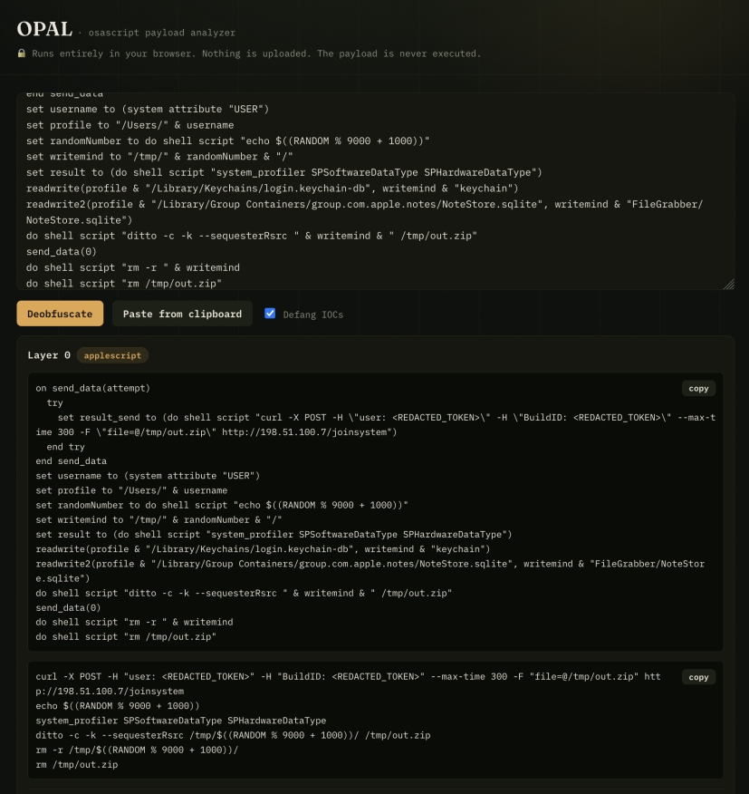
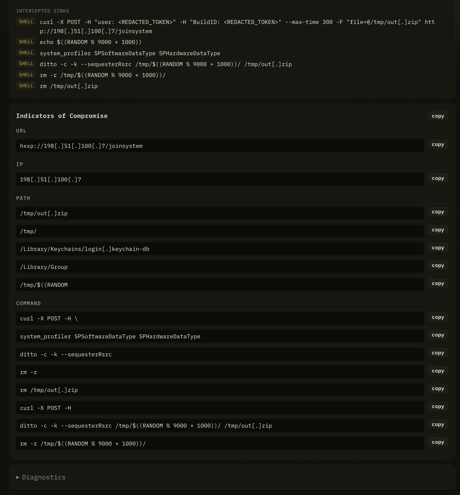

# OPAL

**O**sascript **P**ayload **A**na**L**yzer — an [open-orchard](https://github.com/open-orchard) project.

Client-side deobfuscator for macOS `osascript` / JXA stagers. Paste an
obfuscated one-liner; it reveals every decoded layer and extracts IOCs —
**without ever executing the payload**. Everything runs in your browser;
nothing is uploaded.

> **Live site:** https://open-orchard.org/opal/

## Screenshots

## How it works

It runs the script's own *decoder* logic in a sandboxed Web Worker (stubbed
JXA/Foundation globals, neutered `eval`/shell/network sinks, hard timeout) and
captures what the script *would* have executed. Decoded layers that are
themselves obfuscated are recursively unwrapped, and indicators of compromise
(URLs, paths, commands, user-agents, base64 blobs) are extracted from every
layer.

## Try it

Paste an obfuscated `osascript` / JXA one-liner into the input (or use the
**Paste from clipboard** button), then **Deobfuscate**.

### v1 limitations

- **JXA/JavaScript only.** Pure AppleScript and compiled `.scpt`/`.scptd`
  binaries are detected/surfaced but not decoded — they are a v2 (CLI) concern.
- **Foundation shims are partial.** Decoders that unpack *via* the ObjC bridge
  work only for the implemented recipes (notably base64 `NSData`→`NSString`);
  anything else is logged under "unsupported calls" rather than decoded.
- **Decoded output is untrusted.** Treat decoded commands/URLs as
  adversary-controlled — see [SECURITY.md](SECURITY.md).

## Develop

Use convienence scripts for installation of node via `./scripts/setup.sh` and typecheck via `./scripts/test.sh`, also `./scripts/preview-pages.sh` to preview the website locally.

Node and git can be utilized from `flake.nix` living at this project's root.

## Architecture

- `packages/engine` — pure-TypeScript, DOM-free deobfuscation core (parser →
  sandbox → Foundation shims → classifier → recursion orchestrator). Reused
  verbatim by the v2 CLI via `JSContext`.
- `packages/web` — the static site: a Web Worker sandbox runner and the UI.

## Security

See [SECURITY.md](SECURITY.md) for the safety model, authorized-use guidance,
and how to report a vulnerability. **Authorized analysis only.**

## License

[ISC](LICENSE).
